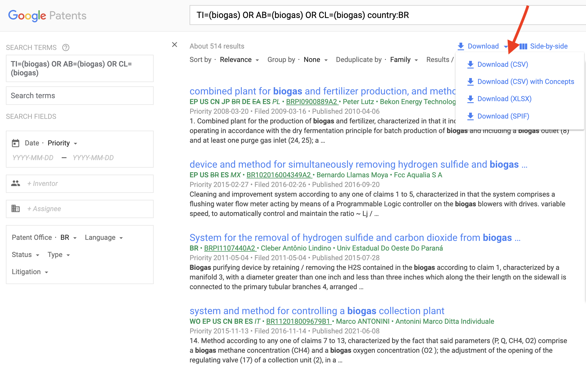

```{r, include = FALSE}
knitr::opts_chunk$set(
  collapse = TRUE,
  comment = "#>"
)
```

# Installation

You can install the development version of `googlepatents` like so:

```r
devtools::install_github("roneyfraga/googlepatents")
```

## `patent_scraping()` easy mode

The tables: `abstract.csv`, `claims.csv`, `cited_by.csv`, `patent_citations.csv` and `ipc.csv` are saved in the `rawfiles_pantents/` directory.

```{r easy-mode, eval = F, echo = T}
library(googlepatents)

patent_scraping(url = 'https://patents.google.com/patent/US10780391B2/en',
                directory = 'rawfiles_patents',
                tables = c('abstract', 'claims', 'cited_by', 'patent_citations', 'ipc'),
                show_progress = FALSE)

fs::dir_ls('rawfiles_patents/')
```

```r 
rawfiles_patents/abstract.csv
rawfiles_patents/cited_by.csv
rawfiles_patents/claims.csv
rawfiles_patents/id.csv
rawfiles_patents/ipc.csv
rawfiles_patents/patent_citations.csv
```

## `patent_scraping()` hard mode

Load data from a exported google patents file.



```{r hard-mode, eval = F, echo = T}

# install.packages(c('purrr', 'furrr'))
library(purrr) 
library(furrr) 

# set the number of cores 
future::plan(multisession, workers = 6)

readr::read_csv('~/Downloads/gp-search-20230830-124212.csv', skip = 1) |> 
  janitor::clean_names() |> 
  dplyr::mutate(id = gsub('[[:punct:]]', '', id)) |> 
  dplyr::mutate(id = stringr::str_trim(id)) ->
  pat

furrr::future_walk(pat$result_link, 
                   patent_scraping, 
                   directory = 'rawfiles_raspagem',
                   tables = c('cited_by', 'patent_citations', 'abstract', 'claims', 'ipc'))

## If Google blocks access to the site, restart from the last patent downloaded.
readr::read_csv('rawfiles_raspagem/id.csv') |>
  dplyr::distinct(id, .keep_all = TRUE) |>
  dplyr::pull(url) ->
  urls_baixadas

pat |>
  dplyr::filter(!(result_link %in% urls_baixadas)) |>
  dplyr::pull(result_link) -> 
  urls_a_baixar

length(urls_a_baixar)

furrr::future_walk(urls_a_baixar, 
                   patent_scraping, 
                   directory = 'rawfiles_raspagem', 
                   tables = c('cited_by', 'patent_citations', 'abstract', 'claims', 'ipc'))
```

## Read `csv` files

```{r read, eval = F, echo = T}

readr::read_csv('rawfiles_raspagem/abstract.csv') |>
  dplyr::filter(!is.na(abstract)) -> 
  abstract

readr::read_csv('rawfiles_raspagem/claims.csv') |>
  dplyr::filter(!is.na(claims)) -> 
  claims

readr::read_csv('rawfiles_raspagem/ipc.csv') |>
  dplyr::filter(!is.na(ipc)) -> 
  ipc

readr::read_csv('rawfiles_raspagem/cited_by.csv') |>
  dplyr::filter(!is.na(publication_number)) -> 
  cited_by

readr::read_csv('rawfiles_raspagem/patent_citations.csv') |>
  dplyr::filter(!is.na(publication_number)) -> 
  patent_citations

```

## Download 25K+ Patents on Google

Set a filter by year on the Google Patents website to limit the search to 25000.

```r
Query
TI=(biogas) OR AB=(biogas) OR CL=(biogas)
About 64,516 results

Download 1
TI=(biogas) OR AB=(biogas) OR CL=(biogas) before:publication:20140101

Download 2
TI=(biogas) OR AB=(biogas) OR CL=(biogas) before:publication:20190101 after:publication:20140102

Download 3
TI=(biogas) OR AB=(biogas) OR CL=(biogas) before:publication:20230908 after:publication:20190102
```

Read several `csv` files exported from Google Patents.

```{r read-all, eval = F, echo = T}

fs::dir_ls('~/Downloads', regexp = 'gp-search.*csv$') |>
  purrr::map(\(x) readr::read_csv(x, skip = 1) |> 
                  tibble::as_tibble() |>
                  janitor::clean_names() |>
                  dplyr::mutate(id = gsub('[[:punct:]]', '', id)) |>
                  dplyr::mutate(id = stringr::str_trim(id))) |>
  dplyr::bind_rows() ->
  pat

```

